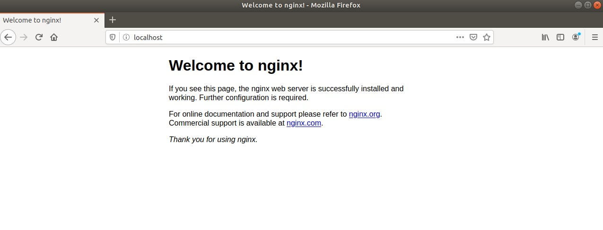

NS Mini Project 3 SSL Certificate
===

## Use nginx to create a simple web server
### install nginx in Ubuntu
```bash
sudo apt update
sudo apt install nginx
```

### Start nginx service
```bash
systemctl restart nginx
```

### Visit `localhost` in web browser to see if nginx is work


## Self-signed Certificate

### Self-signed Root CA
#### 1. Use `openssl` to generate the private key of Root CA
```bash
openssl genrsa  -out RootCA.key 2048
```

#### 2. Generate root certificate request file
```bash
openssl req -new -key RootCA.key -out RootCA.req
```

#### 3. Use the request file to generate the root certificate
```bash
openssl x509 -req -days 3650 -sha256 -extensions v3_ca -signkey RootCA.key -in RootCA.req -out RootCA.pem
```

### Self-signed server certificate
#### 1. Generate the private key of the server
```bash
openssl genrsa -out ServerCert.key 2048
```

#### 2. Generate the certificate reqeuest file
```bash
openssl req -new -key ServerCert.key -out ServerCert.req
```

#### 3. Generate the server certificate
```
openssl x509 -req -days 3650 -sha256 -extensions v3_req -CA RootCA.crt -CAkey RootCA.key -CAcreateserial -in ServerCert.req -out ServerCert.pem
```
