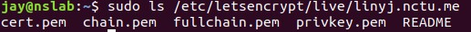

NS Mini Project 3 SSL Certificate
===

In this tutorial, I will introduce how to upgrade your website from http to https using 2 different method, [Let's Encrypt](https://letsencrypt.org/) or self-signed certificate.

# Contents
- [Preparation](#Preparation)
- [1. HTTPS with Perfect Forward Secrecy](#1.-HTTPS-with-Perfect-Forward-Secrecy)
- [2. HTTPS with Self-signed Certificate](#2.-HTTPS-with-Self-signed-Certificate)
- [3. Decrypt HTTPS Encryption](#3.-Decrypt-HTTPS-Encryption)

# Preparation
Before getting started, you should prepare a web server to test. We can use nginx to set up a simple web server quickly.

## Use nginx to set up a simple web server
### Install Nginx in Ubuntu
```bash
sudo apt update
sudo apt install nginx
```

### Start Nginx service
```bash
systemctl restart nginx
```

### Visit http://localhost to see if nginx is work


# 1. HTTPS with Perfect Forward Secrecy
> In this chapter, you will learn how to set up a web server supporting https with perfect forward secrecy. And we will use [Let's Encrypt](https://letsencrypt.org/) to get a free certificate for your web server.

## ACME Protocol
### Introduction
[Automatic Certificate Management Environment](https://en.wikipedia.org/wiki/Automated_Certificate_Management_Environment), ACME, is a protocol that make it possible to set up an HTTPS server and have it automatically obtain a browser-trusted certificate, without any human intervention. This is accomplished by running a certificate management agent on the web server. [1]

### How ACME works with Let's Encrypt
For **HTTP-01** challenge, Let's Encrypt gives a token to the ACME client, and the client should puts a file which contains the token, plus a thumbprint of the account key, on your web server at `http://<your-domain>/.well-known/acme-challenge/<token>`. After putting the file, the ACME client tells Let's Encrypt that the file is ready, then Let's Encrypt will try to retrieve this file via the url mentioned above. [2]


### Reference
- [1] [Let's Encrypt - How It Works](https://letsencrypt.org/zh-tw/how-it-works/)
- [2] [Let's Encrypt - Challenge Types](https://letsencrypt.org/zh-tw/docs/challenge-types/)
- [3] [RFC 8555 - ACME](https://tools.ietf.org/html/rfc8555)

## HTTP to HTTPS - Let's Encrypt Tutorial
If you want to use Let's Encrypt to get the certificate for your website, you should get your own domain name first. There are many online services that allows us to apply a free domain name. In this tutorial, I use [nctu.me](https://nctu.me) to apply for a domain name `linyj.nctu.me`.

### Step 1 - Install Certbot
As mentioned above, Let's Encrypt uses the ACME protocol to verify domain name and to issue the certificate. So we need to install a ACME client first. Let's Encrypt recommends to use **Certbot**.
```bash
sudo add-apt-repository ppa:certbot/certbot
sudo apt-get update
sudo apt-get install certbot python3-certbot-nginx
```

### Step 2 - Modify Nginx Configuration
Add the following lines to `/etc/nginx/sites-available/default`
```
location ~ /.well-known {
     allow all;
}
```
After the modification, remember to reload Nginx
```bash
sudo systemctl reload nginx
```

### Step 3 - Apply a certificate from Let's Encrypt using certbot
> NOTE: in the following document, please replace linyj.nctu.me with your own domain name

For security reason, Let's Encrypt will deny requests if you failed too many times. To avoid this situation, before sending a real request to Let's Encrypt, we can use the test environment provided by Let's Encrypt to test if our network configuration(firewall setting, port forwarding for VM, etc) is setting correctly.

To use this test environment, use `--dry-run` option in the command:
```bash
sudo certbot certonly --nginx -d linyj.nctu.me --dry-run
```

if there is no error in the output, we can send a real request now:
```bash
sudo certbot certonly --nginx -d linyj.nctu.me
```


Once you pass the authentication, you will see a congratulation message in the output. Then the certificate and the related files will be saved at `/etc/letencrypt/live/linyj.nctu.me/`



### Step 4 - Enable https with perfect forward secrecy
We have already get the website's certificate and related files through Let's Encrypt. Now we need to configure Nginx to start using https with perfect forward secrecy on our web server.

#### Generate Diffie-Hellman parameters
To enable perfect forward secrecy feature, we need a Diffie-Hellman parameters. We can use openssl to generate one.
```bash
sudo openssl dhparam -out /etc/ssl/certs/dhparam.pem 2048
```

#### Nginx with https
- Edit `/etc/nginx/snippets/ssl-linyj.nctu.me.conf`
    - Add the following lines to the file
    ```bash
    ssl_certificate /etc/letsencrypt/live/linyj.nctu.me/fullchain.pem;
    ssl_certificate_key /etc/letsencrypt/live/linyj.nctu.me/privkey.pem;
    ```

- Edit `/etc/nginx/snippets/ssl-params.conf`
    - Add the following lines to the file
    ```bash
    ssl_protocols TLSv1 TLSv1.1 TLSv1.2;
    ssl_prefer_server_ciphers on;
    ssl_ciphers "EECDH+ECDSA+AESGCM EECDH+aRSA+AESGCM EECDH+ECDSA+SHA384 EECDH+ECDSA+SHA256 EECDH+aRSA+SHA384 EECDH+aRSA+SHA256 EECDH+aRSA+RC4 EECDH EDH+aRSA RC4 !aNULL !eNULL !LOW !3DES !MD5 !EXP !PSK !SRP !DSS !MEDIUM";
    ssl_dhparam /etc/ssl/certs/dhparam.pem;
    ```

- Edit `/etc/nginx/sites-available/default`
    - Comment the following 2 lines
        ```
        listen 80 default_server;
        listen [::]:80 default_server;
        ```
    - Add rhe following lines
        ```
        listen 443 ssl http2 default_server;
        listen [::]:443 ssl http2 default_server;
        include snippets/ssl-linyj.nctu.me.conf;
        include snippets/ssl-params.conf;
        ```
    - Add a new server block with the following setting, this will let Nginx redirect http to https automatically
        ```
        server {
            listen 80 default_server;
            listen [::]:80 default_server;
            server_name linyj.nctu.me;
            return 301 https://$server_name$request_uri;
        }
        ```
    > You can look an example configure file [here](nginx-example.conf)

### Step 5 - Reload Nginx
```bash
sudo nginx -t               # check if there is any error with your config file
sudo systemctl reload nginx
```

After reload Nginx, you can visit https://linyj.nctu.me to see if https is work


And when you visit http://linyj.nctu.me, you can see that Nginx redirect you to https://linyj.nctu.me automatically.

### Reference
  - [1] [教學 - 申請Let’s Encrypt憑證與啟用https (Nginx)](https://xenby.com/b/101-%E6%95%99%E5%AD%B8-%E7%94%B3%E8%AB%8Blets-encrypt%E6%86%91%E8%AD%89%E8%88%87%E5%95%9F%E7%94%A8https-nginx)
  - [2] [Implementing SSL Perfect Forward Secrecy in NGINX Web-Server](https://www.howtoforge.com/ssl-perfect-forward-secrecy-in-nginx-webserver)
  - [3] [Configuring Apache, Nginx, and OpenSSL for Forward Secrecy](https://blog.qualys.com/ssllabs/2013/08/05/configuring-apache-nginx-and-openssl-for-forward-secrecy)

# 2. HTTPS with Self-signed Certificate
> In the previous chapter, we have learned how to apply for a certificate for our own web server by using Let's Encrypt. This chapter will teach you how to use **openssl** genarate and use self-signed certificate to enable https on the web server.

Before generate a self-signed certificate for your website, you need to create a Root CA by yourself, then use this Root CA to issue yourself a certificate for your website. So this tutorial will be divided to two parts: the first part is the tutorial for generating a Root CA certificate and the second part is the tutorial for generating a web server certificate. Finally, because this Root CA is created by yourself, you need to add the certificate of this Root CA to the browser so that the browser can trust the certificates issued by this Root CA.

## Self-signed Root CA
### Step 1 - Generate the private key of Root CA
```bash
openssl genrsa -out RootCA.key 2048
```

### Step 2 - Generate root certificate request file
```bash
openssl req -new -key RootCA.key -out RootCA.req
```

### Step 3 - Use the request file to generate the root certificate
```bash
openssl x509 -req -days 3650 -sha256 -extensions v3_ca -signkey RootCA.key -in RootCA.req -out RootCA.crt
```

## Self-signed server certificate
### Step 1 - Generate the private key of the server
```bash
openssl genrsa -out ServerCert.key 2048
```

### Step 2 - Generate the certificate reqeuest file
```bash
openssl req -new -key ServerCert.key -out ServerCert.req
```

### Step 3 - Generate the server certificate
```
openssl x509 -req -days 3650 -sha256 -extensions v3_req -CA RootCA.crt -CAkey RootCA.key -CAcreateserial -in ServerCert.req -out ServerCert.crt
```

## Add Root CA certificate to the browser (Use Firefox as example)

- Firefox -> Preferences -> Privacy & Security -> View Certificates

    

- Import your `RootCA.crt` to the Authorities

    

- After importing `RootCA.crt`, you can see Firefox says that your website is `Connection secure` now

    

# 3. Decrypt HTTPS Encryption
