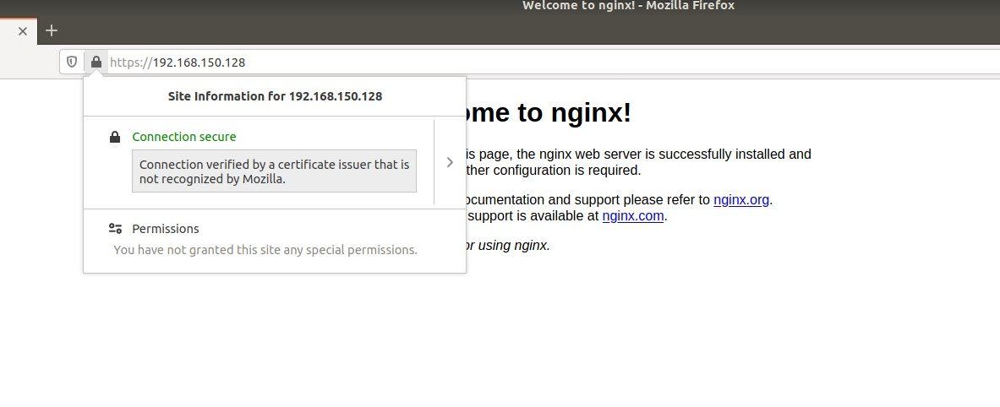

NS Mini Project 3 SSL Certificate
===

In this tutorial, I will introduce how to upgrade your website from http to https using 2 different method, [Let's Encrypt](https://letsencrypt.org/) or self-signed certificate.

## Preparation
Before getting started, you should prepare a web server to test. We can use nginx to set up a simple web server quickly.

### Use nginx to set up a simple web server
#### Install Nginx in Ubuntu
```bash
sudo apt update
sudo apt install nginx
```

#### Start Nginx service
```bash
systemctl restart nginx
```

#### Visit http://localhost to see if nginx is work


## 1. HTTPS with perfect forward secrecy
### What is Perfect Forward Secrecy ?
### ACME Protocol

### Let's Encrypt Tutorial
If you want to use Let's Encrypt to get the certificate for your website, you should get your own domain name first. There are many online service that allows us to apply a free domain name. In this tutorial, I use [nctu.me](https://nctu.me) to apply for a domain name `linyj.nctu.me`.

#### Step 1 - Install Certbot
```bash
sudo add-apt-repository ppa:certbot/certbot
sudo apt-get update
sudo apt-get install certbot
```

#### Step 2 - Modify Nginx Configuration
Add the following line to `/etc/nginx/sites-available/default`
```
location ~ /.well-known {
     allow all;
}
```

#### Step 3 - Reload Nginx
```bash
sudo systemctl reload nginx
```

#### Step 4 - Apply a certificate from Let's Encrypt using certbot
> NOTE: in the following document, please replace linyj.nctu.me with your own domain name

For security reason, Let's Encrypt will deny requests if you failed to authentication too many times. To avoid this situation, before sending a real request to Let's Encrypt, we can use the test environment provided by Let's Encrypt to test if our network configuration is setting correctly.

To use this test environment, use `--dry-run` option in the command:
```bash
sudo certbot certonly --nginx -d linyj.nctu.me --dry-run
```

if there is no error in the output, we can send a real request now:
```bash
sudo certbot certonly --nginx -d linyj.nctu.me
```


Once you pass the authentication, you will see a congratulation message on the screen. Then the certificate and private key will be saved at `/etc/letencrypt/live/linyj.nctu.me/`

#### Step 5 - Configure Nginx to apply https
We have already get the website's certificate and related files through *Let's Encrypt*. Now we need to configurate Nginx to tell it where are the files.

- Edit `/etc/nginx/snippets/ssl-linyj.nctu.me.conf`
    ```bash
    # add the following 2 lines to the file
    ssl_certificate /etc/letsencrypt/live/linyj.nctu.me/fullchain.pem;
    ssl_certificate_key /etc/letsencrypt/live/linyj.nctu.me/privkey.pem;
    ```

- Edit `/etc/nginx/snippets/ssl-params.conf`
    ```bash
    # add the following lines to the file
    ssl_protocols TLSv1 TLSv1.1 TLSv1.2;
    ssl_prefer_server_ciphers on;
    ssl_ciphers "EECDH+AESGCM:EDH+AESGCM:AES256+EECDH:AES256+EDH";
    ssl_ecdh_curve secp384r1;
    ssl_session_cache shared:SSL:10m;
    ssl_session_tickets off;
    ssl_stapling on;
    ssl_stapling_verify on;
    resolver 8.8.8.8 8.8.4.4 valid=300s;
    resolver_timeout 5s;
    add_header X-Frame-Options DENY;
    add_header X-Content-Type-Options nosniff;
    ssl_dhparam /etc/ssl/certs/dhparam.pem;
    ```

- Edit `/etc/nginx/sites-available/default`
    - Comment the following 2 lines
        ```
        listen 80 default_server;
        listen [::]:80 default_server;
        ```
    - Add rhe following lines
        ```
        listen 443 ssl http2 default_server;
        listen [::]:443 ssl http2 default_server;
        include snippets/ssl-linyj.nctu.me.conf;
        include snippets/ssl-params.conf;
        ```
    - Add a new server block with the following setting, this will let Nginx redirect http to https automatically
        ```
        server {
            listen 80 default_server;
            listen [::]:80 default_server;
            server_name linyj.nctu.me;
            return 301 https://$server_name$request_uri;
        }
        ```
#### Step 6 - Reload Nginx
```bash
sudo systemctl reload nginx
```

After reload Nginx, you can visit https://linyj.nctu.me to see if https is work


And when you visit http://linyj.nctu.me, you can see that Nginx redirect you to https://linyj.nctu.me automatically

## 2. Self-signed Certificate
### Self-signed Root CA
#### 1. Use `openssl` to generate the private key of Root CA
```bash
openssl genrsa  -out RootCA.key 2048
```

#### 2. Generate root certificate request file
```bash
openssl req -new -key RootCA.key -out RootCA.req
```

#### 3. Use the request file to generate the root certificate
```bash
openssl x509 -req -days 3650 -sha256 -extensions v3_ca -signkey RootCA.key -in RootCA.req -out RootCA.crt
```

### Self-signed server certificate
#### 1. Generate the private key of the server
```bash
openssl genrsa -out ServerCert.key 2048
```

#### 2. Generate the certificate reqeuest file
```bash
openssl req -new -key ServerCert.key -out ServerCert.req
```

#### 3. Generate the server certificate
```
openssl x509 -req -days 3650 -sha256 -extensions v3_req -CA RootCA.crt -CAkey RootCA.key -CAcreateserial -in ServerCert.req -out ServerCert.crt
```

---

#### Add Root CA certificate to the browser (Use Firefox as example)

Firefox -> Preferences -> Privacy & Security -> View Certificates


Import your `RootCA.crt` to the Authorities


After importing `RootCA.crt`, you can see Firefox says that your website is `Connection secure` now

